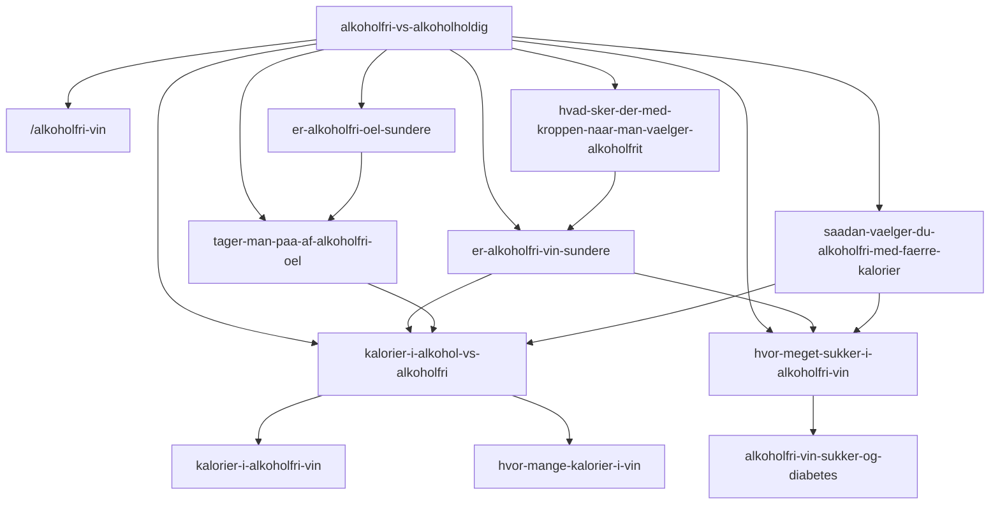

# Content map: Alkoholfri · kalorier · sundhed (hybrid A)

Opdateret: 2026-09-25. Primært formål: SEO-stærke, faktuelle guides uden overdrevne sundhedspåstande.

## Rollefordeling (cannibalization)

| Primær keyword | Primær URL | Søgeintention | Supporting (eksisterende) |
|----------------|------------|---------------|---------------------------|
| er alkoholfri vin sundere | `/guides/er-alkoholfri-vin-sundere` | YMYL-sammenligning / beslutning | `kalorier-i-alkoholfri-vin`, `mindful-drikke-low-no-alkohol` |
| er alkoholfri øl sundere | `/guides/er-alkoholfri-oel-sundere` | YMYL-sammenligning øl | (ny klynge; CTA til AF-vin) |
| tager man på af alkoholfri øl | `/guides/tager-man-paa-af-alkoholfri-oel` | Vægt / kaloriebalance | `kalorier-i-alkohol-vs-alkoholfri` |
| kalorier alkohol vs alkoholfri | `/guides/kalorier-i-alkohol-vs-alkoholfri` | Tværgående tabel (vin+øl) | `hvor-mange-kalorier-i-vin`, `kalorier-i-alkoholfri-vin`, `kalorier-i-alkoholfri-hvidvin` |
| hvor meget sukker alkoholfri vin | `/guides/hvor-meget-sukker-i-alkoholfri-vin` | Sukker/restsukker i 0 % | `alkoholfri-vin-sukker-og-diabetes` (diabetes), `hvad-er-restsukker-i-vin` (begreb) |
| hvad sker der med kroppen | `/guides/hvad-sker-der-med-kroppen-naar-man-vaelger-alkoholfrit` | Effekt af at skære alkohol | SST/SDU-kilder; ikke detox |
| alkoholfri færre kalorier vælg | `/guides/saadan-vaelger-du-alkoholfri-med-faerre-kalorier` | Praktisk købsguide | tabel- og sukker-guides |
| alkoholfri vs alkoholholdig | `/guides/alkoholfri-vs-alkoholholdig` | Pillar / overblik | `/alkoholfri-vin` (kommerciel hub), `bedste-alkoholfri-vin` (produkt) |

**Regel:** Én primær URL pr. intent. Eksisterende kalorie-guides snævres til «kun vin» / «kun AF-vin» og linker op til den nye tværgående tabel.

## Intern linking

## Kilder (sundhed & næringsstof)

- EU forordning 1169/2011 bilag XIV: alkohol **7 kcal/g**, kulhydrat **4 kcal/g**
- DTU Frida: bl.a. fødevare-ID 168 (hvidvin), 213 (rødvin), 232 (sød hvid), 171 (AF rød/rosé), 1906 (classic pilsner)
- Sundhedsstyrelsen: 10-4-anbefaling; søvn; «ca. halvdelen» kcal i AF øl vs øl
- Fødevarestyrelsen: «alkoholfri» typisk max **0,5 vol.-%** (vejledende)
- Diabetesforeningen: oversigt over næringsindhold i alkoholiske drikke (Frida-baseret)

Produktspecifikke tal: kun fra producentens næringsdeklaration — ellers «tjek etiketten».
