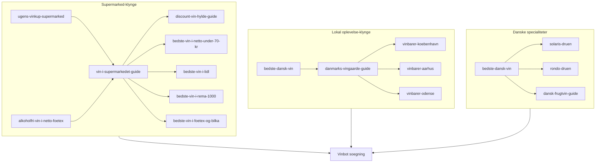

# Lokal & personlig indholdsplan (supermarked · vinturisme · dansk stolthed)

Strategi baseret på Gemini-research (sep 2026): lukke hullet mellem Vinbots stærke **online-søgning** og den situation, hvor danskeren står i butikken, planlægger weekendtur eller vil forstå danske druer/frugtvine.

**Princip:** Fang brugeren *før* eller *ved siden af* onlinekøb → giv hurtig, jordnær vejledning → send videre til [Vinbot-søgning](/) for samme stil, bedre udvalg eller næste flaske.

**Ikke i scope her:** Ny CMS, scrapere af kæde-tilbud, eller fabrikerede «ugens kup»-priser uden verificerbar kilde.

---

## Nuværende dækning (baseline)

| Spor | Findes i dag | Hul |
|------|--------------|-----|
| Supermarked | [`bedste-vin-i-netto-under-70-kr`](/guides/bedste-vin-i-netto-under-70-kr), [`alkoholfri-vin-i-netto-foetex`](/guides/alkoholfri-vin-i-netto-foetex) | Ingen Lidl/Rema/Føtex/Coop alkoholisk hylde-guide; ingen tværkæde-navigationsguide; ingen fast «kup»-rytme |
| Dansk vin | [`bedste-dansk-vin`](/guides/bedste-dansk-vin) (stærk pillar: producenter, Solaris/Rondo, korte besøg/ruter) | Ingen dedikeret rejseguide; ingen by-vinbarer; ingen `*-druen`-sider for Solaris/Rondo; ingen frugtvin/dessert-parring |
| Online/budget | Mange `bedste-*-under-*`, [`vin-tilbud-og-foer-pris`](/guides/vin-tilbud-og-foer-pris), Vivino-guide | Svag bro fra fysisk hylde → online alternativ |

SEO-matrix markerer i dag «Dansk vin, vingård» som dækket af `bedste-dansk-vin`. Det er korrekt for **kommerciel/produkt-intent**, men **ikke** for lokal oplevelse, by-guides eller drue-/frugtvin-dybde.

---

## Mål og succesmål

1. **Genbesøg:** Brugere vender tilbage til supermarket-klyngen (fredag-intent).
2. **Top-of-funnel:** Trafik på oplevelses- og stoltheds-søgninger, der senere konverterer til søgning/affiliate.
3. **Klynge-styrke:** Hver ny URL linker til pillar + mindst ét Vinbot-søgelink i samme stil/prislag.
4. **EEAT:** Ærlige begrænsninger (sortiment skifter; besøg kræver booking; priser er vejledende).

**Måling** (jf. [`growth-measurement-checklist.md`](./growth-measurement-checklist.md)): GSC impressions/CTR pr. slug, internt klik til `/?q=…`, tid på side. Ingen krav om ugentlige spotpris-opdateringer for at kalde sporet «live».

---

## Arkitektur: tre klynger → én pillar hver

**Hub-beslutning (fase 1):** Ingen ny `/supermarked`-hub-route endnu. Brug eksisterende `/bedste-vine` + cluster-links i [`lib/growth/guide-cluster-links.ts`](../lib/growth/guide-cluster-links.ts) og krydslinks i MDX. Hub-side (`/supermarked-vin` eller udvidelse af bedste-vine) først når klyngen har ≥6 live URL’er.

**Hub-beslutning (dansk):** Behold `bedste-dansk-vin` som produkt-pillar. Nye sider får `hub: bedste-vine` (oplevelse/stolthed) eller `hub: vin-viden` (druer) — ikke ny topnav-post i fase 1.

---

## Spor 1 — Supermarkeds-tjek

### Positionering

Vinbot sælger ikke Netto-vin. Guiden er **telefon-ved-hylden**: stil, drue, region, undgå-liste → CTA til online-søgning i samme prislag.

### Evergreen vs. «ugentlig kup»

| Type | Cadence | Indhold | Risiko |
|------|---------|---------|--------|
| Navigations- / kædeguides | Opdater ved sortimentsskift (mål: kvartalsvis) | Druer, regioner, «gå efter / hold dig fra» | Lav |
| «Ugens/månedens vinkup» | **Månedlig** (ikke ugentlig i v1) | Evergreen kup-logik + 5–8 *typiske* faste flasker/stilarter pr. kæde; eksplicit: spotvarer skifter | Middel hvis vi lover aktuelle tilbud uden kilde |

**v1-regel:** Ingen scrapede spotpriser. Titel/meta må gerne ramme søgeord som «vin tilbud netto», men brødtekst skal være stil-baseret + «tjek hylden / sammenlign online».

### Artikler (spor 1)

| Prio | Slug | Titel (arbejds) | Primær intent | Hub | Status |
|------|------|-----------------|---------------|-----|--------|
| P0 | `vin-i-supermarkedet-guide` | Vin i supermarkedet: sådan vælger du på hylden | Broad: «vin i netto/supermarked» | bedste-vine | **Ny pillar** |
| P0 | `discount-vin-hylde-guide` | Discount-hylden under 70 kr: druer og regioner der holder | Navigationsguide Rema/Lidl/Netto-logik | bedste-vine | **Ny** |
| P0 | `bedste-vin-i-netto-under-70-kr` | (eksisterende) | Netto under 70 | bedste-vine | **Udvid** (tværkæde-links + søge-CTA) |
| P1 | `bedste-vin-i-lidl` | Bedste vin i Lidl: hvad du skal gå efter | Lidl-hylde | bedste-vine | **Ny** |
| P1 | `bedste-vin-i-rema-1000` | Bedste vin i Rema 1000 under 80 kr | Rema-hylde | bedste-vine | **Ny** |
| P1 | `bedste-vin-i-foetex-og-bilka` | Vin i Føtex og Bilka: bedre hylde, samme regler | SuperBrugsen-tier | bedste-vine | **Ny** |
| P1 | `alkoholfri-vin-i-netto-foetex` | (eksisterende) | 0 % i kæder | bedste-vine | **Udvid** krydslink til ny pillar |
| P2 | `ugens-vinkup-supermarked` | Månedens vinkup i supermarkedet (Netto, Rema, Lidl, Føtex, Coop) | Genbesøg / «vin tilbud» | bedste-vine | **Ny** (månedlig `updated`) |
| P2 | `vin-i-coop-365-og-kvickly` | Vin i Coop 365 og Kvickly | Coop-hylde | bedste-vine | **Ny** efter P1 |

### Indholds-skabelon (kædeguide)

1. Intro: hvem står hvor (fredag 17) + Vinbot sælger ikke kæde-vin.  
2. Tabel: type → hvorfor det holder → kig efter på etiketten.  
3. Undgå-liste (marketing, tung «premium» uden region).  
4. 60-sekunders strategi.  
5. «Samme stil online» med 1–2 `/?q=…&max=`-links.  
6. `## Læs mere i klyngen` → pillar + søskende + budget-guides.

Tone og længde: som Netto-guiden (kort, scannbar) — **500–900 ord**, ikke 2000.

### Intern linking (spor 1)

- Alle kædeguides ↔ `vin-i-supermarkedet-guide` + `discount-vin-hylde-guide`
- Til: `bedste-rodvin-under-75-kr`, `bedste-vin-under-100-kr`, `bedste-box-vin`, `vin-tilbud-og-foer-pris`, `vivino-app-til-vin-anmeldelser`
- Alkoholfri-klynge ↔ supermarket-pillar
- Tilføj blok i `guide-cluster-links.ts` (som alkoholfri-blokken)

---

## Spor 2 — Oplevelser og lokal vinturisme

### Positionering

`bedste-dansk-vin` = **hvad skal jeg købe / hvilke producenter**.  
Ny rejseguide = **hvor tager jeg hen i weekenden**.  
Vinbar-guides = **hyggelig by-oplevelse uden snobberi** (passer til Vinbots tone).

### Artikler (spor 2)

| Prio | Slug | Titel (arbejds) | Primær intent | Hub | Status |
|------|------|-----------------|---------------|-----|--------|
| P0 | `danmarks-vingaarde-guide` | Den ultimative guide til Danmarks vingårde: besøg, smagning og overnatning | «danske vingårde», «vinsmagning danmark» | bedste-vine | **Ny** (træk besøgsafsnit ud/udvid fra pillar) |
| P1 | `vinbarer-koebenhavn` | 5 hyggelige vinbarer i København med god vin uden snobberi | «vinbar københavn» | bedste-vine | **Ny** |
| P1 | `vinbarer-aarhus` | Hyggelige vinbarer i Aarhus | «vinbar aarhus» | bedste-vine | **Ny** |
| P2 | `vinbarer-odense` | Vinbarer i Odense | «vinbar odense» | bedste-vine | **Ny** |
| P2 | — | (valgfrit senere) regionale weekend-ruter som egne URL’er kun ved GSC-volumen | — | — | Afvent GSC |

### Rejseguide — obligatoriske sektioner

- Sjælland / Fyn / Jylland / Bornholm: 3–6 gårde med **besøg** (smagning, restaurant, overnatning) — kun gårde der offentligt tilbyder det.
- Booking-note: ring/book; åbningstider skifter.
- Vinruter (genbrug/udvid fra `bedste-dansk-vin`).
- Festivaler (årstal + «tjek officiel side»).
- CTA: køb danske flasker online via søgning *efter* besøg, eller find lignende stil (Solaris, crémant).
- Krydslink til `bedste-dansk-vin`, `solaris-druen`, `rondo-druen`.

### Vinbar-guides — regler

- **5 steder** pr. by (ikke 15) — kurateret, jordnær.
- Kriterier i intro: god vin, afslappet, ikke «point-jagt».
- Undgå fabrikerede anmeldelser; beskriv *type* (naturvin / klassisk / by-vinbar) og kvarter.
- Opdateringsdato synlig; ingen påstande om «bedste i byen» uden forbehold.
- CTA: «Vil du drikke samme stil hjemme?» → søgelink (nebbiolo, chenin, natural osv. efter bar-profil).

### Intern linking (spor 2)

- `bedste-dansk-vin` får nyt afsnit «Planlæg besøg» → `danmarks-vingaarde-guide`
- Vinbarer ↔ hinanden + dansk pillar (gave/oplevelse)
- Region-/landeguides (Italien, Frankrig) forbliver separate — ingen kanibalisme

---

## Spor 3 — Danske specialiteter og stolthed

### Positionering

Pillar nævner allerede Solaris/Rondo/Cold Hand. Nye sider er **pædagogiske dybde-URL’er** i samme mønster som `tempranillo-druen` / `*-druen`, plus én frugtvin-guide med madparring (dessert, kransekage, ost).

### Artikler (spor 3)

| Prio | Slug | Titel (arbejds) | Primær intent | Hub | Status |
|------|------|-----------------|---------------|-----|--------|
| P0 | `solaris-druen` | Solaris-druen: derfor smager dansk hvidvin af hyldeblomst og syre | «solaris vin», «dansk hvidvin» | vin-viden / mad-og-vin | **Ny** (`*-druen`-mønster) |
| P0 | `rondo-druen` | Rondo-druen: dansk rødvin i køligt klima | «rondo vin» | vin-viden / mad-og-vin | **Ny** |
| P1 | `dansk-frugtvin-guide` | Dansk frugtvin og kirsebærvin: Cold Hand-stil, dessert og ost | «frugtvin», «kirsebærvin», «æblevin danmark» | bedste-vine | **Ny** |
| P2 | `vin-til-kransekage` | Vin til kransekage (og nordisk dessert) | Madparring | mad-og-vin | **Ny** kun hvis GSC/intent ikke dækkes af frugtvin-guiden |
| P2 | `cabernet-cortis-druen` / `regent-druen` | Øvrige DK-hybrider | Niche | vin-viden | **Senere** |

### Drue-sider — minimum

Følg [`*-druen`](../content/guides/tempranillo-druen.mdx)-mønster: smagsbillede, klima, forskel ift. Pinot/Chardonnay, danske producenter, madparring, søge-CTA, link til `bedste-dansk-vin` + rejseguide.

### Frugtvin-guide — minimum

- Hvad er frugtvin vs. druevin (ærligt, uden «det er også rigtig vin»-skam).
- Kirsebær, æble, solbær — intensitet og sødme.
- Parring: dessert, kransekage, blåskimmel/gedeost.
- Eksempler på kendte huse (fx Cold Hand) uden opdigtet tasting note-fabrik.
- Søgelink til dessertvin / søde stilarter online.

---

## Prioriterede bølger (produktion)

### Bølge A — Fundament (skriv først)

1. `vin-i-supermarkedet-guide`  
2. `discount-vin-hylde-guide`  
3. Udvid `bedste-vin-i-netto-under-70-kr` + `alkoholfri-vin-i-netto-foetex` med klynge-links  
4. `danmarks-vingaarde-guide`  
5. `solaris-druen`  
6. `rondo-druen`  
7. Opdater `bedste-dansk-vin` (besøg → ny rejseguide; druer → nye druesider)  
8. SEO: FAQ i `lib/guide-faq.ts`, SERP i `lib/seo/serp-meta.ts` hvor nødvendigt, cluster-blok i `guide-cluster-links.ts`  
9. Opdater [`seo-keyword-gap-matrix.md`](./seo-keyword-gap-matrix.md) (gøres i samme PR som denne plan)

### Bølge B — Kæder + byer

1. `bedste-vin-i-lidl` — **live**
2. `bedste-vin-i-rema-1000` — **live**
3. `bedste-vin-i-foetex-og-bilka` — **live**
4. `dansk-frugtvin-guide` — **live**
5. `vinbarer-koebenhavn` — **live**
6. `vinbarer-aarhus` — **live**

### Bølge C — Genbesøg + long tail

1. `ugens-vinkup-supermarked` — **live** (månedlig redaktionel rytme)  
2. `vin-i-coop-365-og-kvickly` — **live**  
3. `vinbarer-odense` — **live**  
4. Evt. `vin-til-kransekage` efter GSC  
5. Hub-side `/supermarked-vin` — **live**

---

## SEO-checklist pr. ny guide

- Frontmatter: `title`, `description` (150–165 tegn), `slug`, `tags`, `updated`, `hub`
- Primær keyword naturligt i H1-ækvivalent (`title`) + første `##`
- 3–5 FAQ i `lib/guide-faq.ts` for P0/P1
- Mindst 4 interne links i klyngen + 1 Vinbot-søgelink
- Ingen kanibalisme: én primær URL pr. cluster (se matrix)
- `updated` ved væsentlig refresh (især kup-siden)
- Sitemap: følger automatisk via `generateStaticParams` / guide-sitemaps

### Søgeclusters → primær slug (nye)

| Cluster | Primær slug | Note |
|---------|-------------|------|
| Vin i netto / supermarked vin | `vin-i-supermarkedet-guide` | Netto under 70 forbliver supporting |
| Billig vin rem a / lidl vin | `discount-vin-hylde-guide` + kædesider | Kædesider for brand-intent |
| Danske vingårde / vinsmagning danmark | `danmarks-vingaarde-guide` | `bedste-dansk-vin` = produkt |
| Vinbar København / Aarhus | `vinbarer-*` | Kurateret lokal |
| Solaris vin / Rondo vin | `solaris-druen`, `rondo-druen` | Pillar linker ned |
| Frugtvin / kirsebærvin / æblevin | `dansk-frugtvin-guide` | Dessertparring her |

---

## Redaktionel rytme efter launch

| Cadence | Handling |
|---------|----------|
| Ved hver ny guide | Commit + push `main` (Vercel) |
| Månedlig | Refresh `ugens-vinkup-supermarked` (`updated` + 1–2 stil-observationer) |
| Kvartalsvis | Spot-check kædeguides (stilarter, ikke priser) + vinbar-listen |
| Halvårlig | Rejseguide (nye gårde, festivaldatoer) |
| Løbende | GSC: hvis «vin tilbud lidl» får volume uden klik → udvid Lidl-side, undgå ny tynd URL |

### SoMe-hooks (valgfrit)

Korte clips/carousels: «3 flasker under 70 i Rema», «Solaris vs Chardonnay på 15 sek», «Weekend på dansk vingård» — pege til guides. Skabeloner kan ligge under `docs/some/` når bølge A er live.

---

## Explicit non-goals

- Ugentlig scraping af Netto/Lidl-tilbud uden datakilde  
- Dedikeret app-feature «scan etiketten»  
- Ranking af vinbarer med stjerner/point  
- At erstatte `bedste-dansk-vin` med rejseguiden (behold begge med klar rollefordeling)  
- Ny topnav-post før indholdskritisk masse

---

## Definition of done (hele programmet)

- Bølge A+B publiceret som MDX under `content/guides/`
- Cluster-links aktive; pillar’er krydslinket
- Keyword-gap-matrix opdateret
- Mindst én måned med GSC-data på P0-slugs før hub-side bygges

**Næste konkrete eksekvering:** implementér Bølge A som separat indholdspr — start med `vin-i-supermarkedet-guide` + `discount-vin-hylde-guide` + `danmarks-vingaarde-guide` + `solaris-druen` / `rondo-druen`.
